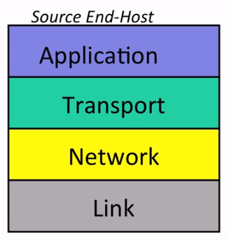

# 计算机网络学习笔记

&nbsp;   
### 参考书籍：

- [TCP/IP详解 卷1：协议]()
- [UNIX网络编程 卷1：套接字联网API]()
- [计算机网络 自顶向下方法（英文第6版）]()
- [Effective TCP/IP Programming（TCPIP高效编程：改善网络程序的44个技巧）]()

### 视频资料：

- [CS144 Introduction to Computer Networking Fall 2016 Stanford University](https://www.youtube.com/playlist?list=PLvFG2xYBrYAQCyz4Wx3NPoYJOFjvU7g2Z)
- [Computer Networking: A Top-Down Approach Sixth Edition](https://wps.pearsoned.com/ecs_kurose_compnetw_6/216/55463/14198700.cw/index.html)
- [计算机网络 - 哈尔滨工业大学](http://www.icourse163.org/course/HIT-154005)
- [IT Support: Networking Essentials - Microsoft: CLD260x](https://courses.edx.org/courses/course-v1:Microsoft+CLD260x+3T2018/course/)

### 笔记资料：

- [Computer Network Tutorials - GeeksforGeeks](https://www.geeksforgeeks.org/computer-network-tutorials/)
- [Data Communication & Computer Network - tutorialspoint](https://www.tutorialspoint.com/data_communication_computer_network/)
- [计算机网络.md](https://github.com/arkingc/note/blob/master/%E8%AE%A1%E7%AE%97%E6%9C%BA%E7%BD%91%E7%BB%9C/%E8%AE%A1%E7%AE%97%E6%9C%BA%E7%BD%91%E7%BB%9C.md)
- [InterviewMap - Network](https://yuchengkai.cn/docs/cs/)
- [Skill-Tree/计算机网络.md](https://github.com/myk502/Skill-Tree/blob/master/%E8%AE%A1%E7%AE%97%E6%9C%BA%E7%BD%91%E7%BB%9C.md)
- [Skill-Tree/网络编程.md](https://github.com/myk502/Skill-Tree/blob/master/%E7%BD%91%E7%BB%9C%E7%BC%96%E7%A8%8B.md)
- [搞定计算机网络面试，看这篇就够了 - 掘金](https://juejin.im/post/5b5f20686fb9a04f844adbdd)

### 实验资料：

- [Beej's Guide to Network Programming - Using Internet Sockets](https://beej.us/guide/bgnet/html/single/bgnet.html)
- [《计算机网络：自顶向下方法》配套实验：TCP模拟器 - 知乎](https://zhuanlan.zhihu.com/p/35390933)
- [Socket 编程实战](https://liujiacai.net/blog/2016/10/31/socket-programming/)

&nbsp;   
## 目录

- [CS144 学习笔记](#CS144)
  - 
  - 
  - 
- [计算机网络 - 哈尔滨工业大学 学习笔记](#computer_network_HIT)
  - 
  - 
  - 
- 
  - 
- 
  - 

&nbsp;   
&nbsp;   

## CS144 学习笔记

### 1. A day in the life of an application
**Bidirectional, reliable byte stream** communication model  
Abstract away entire network -- just a pipe between 2 programs  
Application Level:

- WWW (HTTP)
- Skype
- BitTorrent

### 2. The four layer Internet model

Early 4 layer internet model:

- **Application**: Bi-directional reliable byte stream between 2 applications, using application-specific semantics(e.g. HTTP, BitTorrent)
- **Transport**: Guarantees correct, in-order delivery of data end-to-end. Controls congestion.
- **Network**: Delivers datagrams end-to-end. Best-effort delivery - no guarantees. Must use the Internet Protocol(IP)
- **Link**: Delivers data over a single link between an end host and router, or between routers.

IP:

- IP makes a best-effort attempt to deliver our datagrams to the other end. But it makes no promises.
- IP datagrams can get lost, can be delivered out of order, and can be corrupted. There are no guarantees.

### 3. The IP service model

**Datagram**: Individually routed packets. Hop-by-hop routing.

- The IP service model provides a service which includes the routing to the destination.   
- The forwarding decision at each router is based on the **IP DA**( destination address).   
- Each router contains a **forwarding table** tells **where to send the packet next** after matching a given destination address. **The router doesnot know the whole path**.   
- Neither the sender nor the receiver know the whole path.

**Unreliable**: Packets might be dropped.

- dropped
- duplicated
- wrong destination

**Best effort**: but onlt if necessary.

**Connectionless**: No per-flow state. Packets might be mis-sequenced.

The reason IP is **simple**:

- Simple, dumb, minimal: faster, more streamlined, lower cost to build and maintain.
- The end-to-end principle: where possible, implement features in the end hosts.
- Allows a variety of reliable (or unreliable) services to be built on top.
- Works over any link layer: IP makes very few assumptions about the link layer below.

**The IP service model**   
1. Tries to prevent packets looping forever. (Because forwarding table might change. IP simply adds a **hop-count** (TTL) field in the header of each datagram)   
2. Will fragment packets if they are too long.   
3. Uses a header checksum to reduce chances of delivering datagram to wrong destination.   
4. Allows for new versions of IP: IPV4 and IPV6   
5. Allows for new options (fields) to be added to header.   

### 4.

&nbsp;   
&nbsp;   

## 计算机网络 - 哈尔滨工业大学 学习笔记

