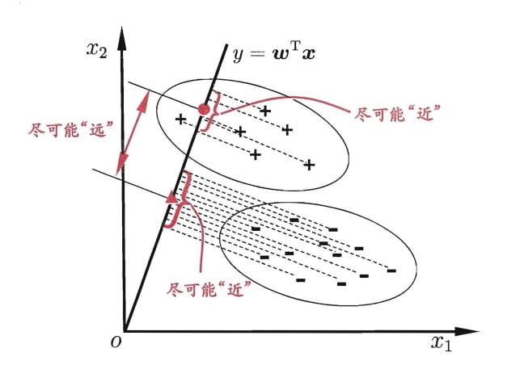

# 西瓜书阅读笔记

## Ch01 绪论

[NFL定理 - No Free Lunch Theorem](https://en.wikipedia.org/wiki/No_free_lunch_theorem)

意义在于：脱离具体问题，空泛地谈论 “什么学习算法更好” 毫无意义。

六七十年代：**符号主义**

八十年代：

​           **从样例中学习**：监督学习、无监督学习等本书大部分内容。

​		包括:
- 决策树
- 基于逻辑的学习（归纳逻辑程序设计）
- 基于神经网络的连接主义学习（著名的BP算法）

九十年代：统计学习（[支持向量机](#6)）

习题1.4 

​       还是假设二分类问题，假设 $f$ 均匀分布，且

​       $\ell (h(x), f(x))=0\quad when\ h(x)=f(x)$

​       $let\ \ \ell(h(x), f(x))=\ell (0,1)=\ell\quad when\ h(x)\neq f(x)$
$$
\begin{aligned}
\sum_f E_{ote}(\mathfrak{L}_a|X,f)&
=\sum_f \sum_h \sum_{\pmb x \in \mathcal{X}-X}P(x) \ell (h(x), f(x)) P(h|X,\mathfrak{L}_a)\\&
=\sum_{\pmb x \in \mathcal{X}-X}P(x) \sum_h P(h|X,\mathfrak{L}_a) \sum_f \ell (h, f)\\&
=\sum_{\pmb x \in \mathcal{X}-X}P(x) \sum_h P(h|X,\mathfrak{L}_a) 2^{|\mathcal{X}|-1}\ell\\&
=2^{|\mathcal{X}|-1}\ell \sum_{\pmb x \in \mathcal{X}-X}P(x)
\end{aligned}
$$

## Ch02 模型评估与选择

[（转）第二章 模型评估与选择](http://cweihang.cn/ml/melon/ch02.html)   

### 2.1 经验误差与过拟合

学习器在训练集上的误差称为 “训练误差” (training error) 或 “**经验误差**” (empirical error)，在新样本上的误差称为 “泛化误差” (generalization error)。我们**希望**得到泛化误差小的学习器，然而**实际**能做的工作是使经验误差最小化。

### 2.2 评估方法

> 测试集应该尽可能与训练集互斥。

#### 2.2.1 留出法

#### 2.2.2 k 折交叉验证

#### 2.2.3 自助法

#### 2.2.4 调参与最终模型

### 2.3 性能度量

### 2.4 比较检验

#### 2.4.1 假设检验

#### 2.4.2 交叉验证 t 检验

#### 2.4.3 McNemar 检验

#### 2.4.4 Friedman 检验 与 Nemenyi 后续检验

### 2.5 偏差与方差

## Ch03 线性模型

### 3.1 基本形式

$ \pmb x=(x_1;x_2;...;x_d)$ 由 $d$ 个属性描述。

线性模型试图学得一个通过属性的线性组合来进行预测的函数。

即 

$\qquad\qquad\qquad\qquad\qquad f(\pmb x)=\pmb {w^Tx}+b$

&emsp;&emsp;&emsp;&emsp;&emsp;&emsp;$f(\pmb x)=\pmb {w^Tx}+b$

$w$ 和 $b$ 学得之后，模型就得以确定。

### 3.2 线性回归

试图学得

$\qquad\qquad\qquad\qquad\qquad f(\pmb {x})=\pmb w^T\pmb x+b  $，使得 $f(\pmb x)\simeq y$

显然关键在于如何衡量 $f(x)$ 与 $y$ 之间的误差，均方误差是回归任务中最常用的性能度量，也就是使用最小二乘法来进行估计。

记$\qquad\qquad\quad \hat{\pmb w}=(\pmb w;b)$
$$
\pmb X=\left (\begin{array}{c:c}
\begin{matrix}
 x_{11}   & x_{12}   & \cdots   & x_{1d}   \\
 x_{21}   & x_{22}   & \cdots   & x_{2d}   \\
 \vdots   & \vdots   & \ddots   & \vdots   \\
 x_{m1}   & x_{m2}   & \cdots   & x_{md}   \\
\end{matrix}&
\begin{matrix}
1      \\
1      \\
\vdots \\
1      \\
\end{matrix}
\end{array}
\right )
=\begin{pmatrix}
\pmb x_1^T   & 1        \\
\pmb x_1^T   & 1        \\
\vdots       & \vdots   \\
\pmb x_1^T   & 1        \\
\end{pmatrix}
$$
$\qquad\qquad\qquad \pmb y=(y_1;y_2;...;y_m)$

于是有
$$
\begin{aligned}
(w^*,b^*)&
=argmin_{(w,b)}\sum_i (f(\pmb{x_i})-y_i)^2\\&
=argmin_{(w,b)}\sum_i (\pmb w^T\pmb{x_i}+b-y_i)^2\\&
=argmin_{(w,b)}\sum_i (\hat{\pmb w}^T\pmb x_i-y_i)^2\\&
=argmin_{(w,b)}(\pmb X\hat{\pmb w}-\pmb y)^T(\pmb X\hat{\pmb w}-\pmb y)
\end{aligned}
$$
令 $E_{\hat{\pmb w}}=(\pmb X\hat{\pmb w}-\pmb y)^T(\pmb X\hat{\pmb w}-\pmb y)$，对 $\hat{\pmb w}$ 求导并解出零点

&emsp;&emsp;&emsp;&emsp;&emsp;&emsp;&emsp;&emsp;&emsp;&emsp;&emsp;&emsp;&emsp;&emsp;&emsp;&emsp;&emsp;&emsp;&emsp;&emsp;&emsp;

$$
\begin{aligned}
\frac{\partial{E_{\hat{\pmb w}}}}{\partial{\hat{\pmb w}}}&
=\frac{\partial}{\partial{\hat{\pmb w}}}(tr((\pmb X\hat{\pmb w}-\pmb y)^T(\pmb X\hat{\pmb w}-\pmb y)))\\&
=\frac{\partial}{\partial{\hat{\pmb w}}}(tr(\hat{\pmb w}^T\pmb X^T\pmb X\hat{\pmb w}-\pmb y^T\pmb X\hat{\pmb w}-\hat{\pmb w}^T\pmb X^T\pmb y+\pmb y^T\pmb y))\\&
=\frac{\partial{tr(\hat{\pmb w}\pmb I\hat{\pmb w}^T\pmb X^T\pmb X)}}{\partial \hat{\pmb w}}-\pmb X^T\pmb y-\pmb X^T\pmb y\\&
=2\pmb X^T(\pmb X\hat{\pmb w}-\pmb y)
\end{aligned}
$$
若 $\pmb X^T\pmb X$ 可逆，令 $\hat{\pmb x}=(\pmb x;1)$，则最终学得的多元线性回归模型为
&emsp;&emsp;&emsp;&emsp;&emsp;&emsp;&emsp;&emsp;&emsp;&emsp;&emsp;&emsp;&emsp;&emsp;&emsp;&emsp;&emsp;&emsp;&emsp;$\hat{\pmb w}=(\pmb X^T\pmb X)^{-1}\pmb X^T\pmb y$
&emsp;&emsp;&emsp;&emsp;&emsp;&emsp;&emsp;&emsp;&emsp;&emsp;&emsp;&emsp;&emsp;&emsp;&emsp;&emsp;&emsp;&emsp;&emsp;$f(\hat{\pmb x})=\hat{\pmb x}^T(\pmb X^T\pmb X)^{-1}\pmb X^T\pmb y$

然而通常 $\pmb X^T\pmb X$ 不可逆，此时可解出多个 $\hat{\pmb w}$，选择哪一个由学习算法的归纳偏好决定，常见的做法是引入**正则化(regularization)项**。

考虑单调可微函数 $g(\cdot)$，令

$y=g^{-1}(\pmb w^T\pmb x+b)$，这样的模型称为 “广义线性模型”。

### 3.3 对数几率回归

对于**分类任务**，我们只需找一个**单调可微函数将**分类任务的**真实标记 $y$** 与**线性回归模型的预测值**联系起来。

对数几率函数 $y=\frac{1}{1+e^{-z}}$

$$
\begin{aligned}
ln\frac{y}{1-y}=\pmb w^T\pmb x+b
\end{aligned}
$$
该模型称为 “对数几率回归”，用线性回归模型的预测结果去逼近真实标记的对数几率。
$$
ln\frac{p(y=1|\pmb x)}{p(y=0|\pmb x)}=\pmb w^T\pmb x+b
$$
记 $\pmb \beta=(\pmb w;b)$，通过极大似然估计得

。。。。书上写的什么玩意。。。

[（转）机器学习系列-Logistic回归：我看你像谁 （下篇）](https://zhuanlan.zhihu.com/p/22692266)

[（转）机器学习－逻辑回归与最大似然估计](http://www.hanlongfei.com/%E6%9C%BA%E5%99%A8%E5%AD%A6%E4%B9%A0/2015/08/05/mle/)

### 3.4 线性判别分析

LDA的思想非常朴素：给定训练样例集，设法将样例投影到一条直线上，使得同类样例的投影点尽可能接近，异类样例 的投影点尽可能远离。

### 3.5 多分类学习

## Ch04

## Ch05

## Ch06

## Ch07 贝叶斯分类器

## Ch08

## Ch09

