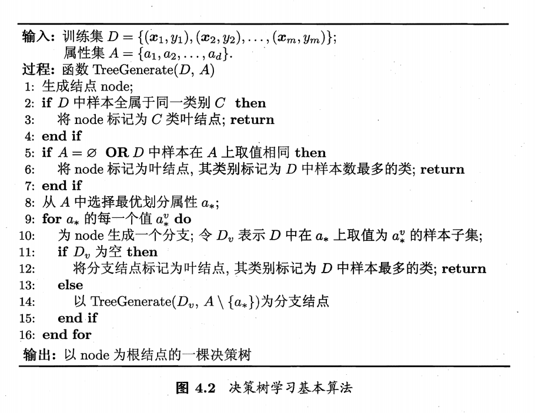
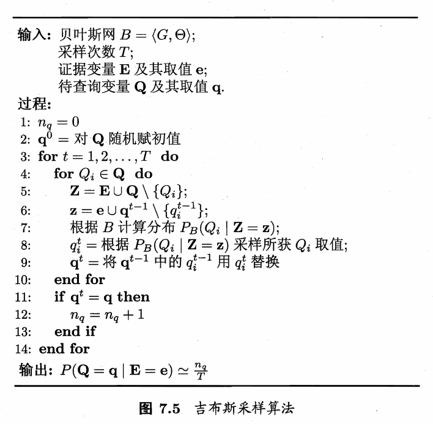

# 西瓜书阅读笔记

## Ch01 绪论

[NFL定理 - No Free Lunch Theorem](https://en.wikipedia.org/wiki/No_free_lunch_theorem)

意义在于：脱离具体问题，空泛地谈论 “什么学习算法更好” 毫无意义。

六七十年代：**符号主义**

八十年代：

​           **从样例中学习**：监督学习、无监督学习等本书大部分内容。

​		包括:
- 决策树
- 基于逻辑的学习（归纳逻辑程序设计）
- 基于神经网络的连接主义学习（著名的BP算法）

九十年代：统计学习（[支持向量机](#6)）

习题1.4 

​       还是假设二分类问题，假设 $f$ 均匀分布，且

​       $\ell (h(x), f(x))=0\quad when\ h(x)=f(x)$

​       $let\ \ \ell(h(x), f(x))=\ell (0,1)=\ell\quad when\ h(x)\neq f(x)$
$$
\begin{aligned}
\sum_f E_{ote}(\mathfrak{L}_a|X,f)&
=\sum_f \sum_h \sum_{\pmb x \in \mathcal{X}-X}P(x) \ell (h(x), f(x)) P(h|X,\mathfrak{L}_a)\\&
=\sum_{\pmb x \in \mathcal{X}-X}P(x) \sum_h P(h|X,\mathfrak{L}_a) \sum_f \ell (h, f)\\&
=\sum_{\pmb x \in \mathcal{X}-X}P(x) \sum_h P(h|X,\mathfrak{L}_a) 2^{|\mathcal{X}|-1}\ell\\&
=2^{|\mathcal{X}|-1}\ell \sum_{\pmb x \in \mathcal{X}-X}P(x)
\end{aligned}
$$

## Ch02 模型评估与选择

[（转）第二章 模型评估与选择](http://cweihang.cn/ml/melon/ch02.html)   

### 2.1 经验误差与过拟合

学习器在训练集上的误差称为 “训练误差” (training error) 或 “**经验误差**” (empirical error)，在新样本上的误差称为 “泛化误差” (generalization error)。我们**希望**得到泛化误差小的学习器，然而**实际**能做的工作是使经验误差最小化。

### 2.2 评估方法

> 测试集应该尽可能与训练集互斥。

#### 2.2.1 留出法

#### 2.2.2 k 折交叉验证

#### 2.2.3 自助法

#### 2.2.4 调参与最终模型

### 2.3 性能度量

### 2.4 比较检验

#### 2.4.1 假设检验

#### 2.4.2 交叉验证 t 检验

#### 2.4.3 McNemar 检验

#### 2.4.4 Friedman 检验 与 Nemenyi 后续检验

### 2.5 偏差与方差

## Ch03 线性模型

### 3.1 基本形式

$ \pmb x=(x_1;x_2;...;x_d)$ 由 $d$ 个属性描述。

线性模型试图学得一个通过属性的线性组合来进行预测的函数。

即 

$\qquad\qquad\qquad\qquad\qquad f(\pmb x)=\pmb {w^Tx}+b$

$w$ 和 $b$ 学得之后，模型就得以确定。

### 3.2 线性回归

试图学得

$\qquad\qquad\qquad\qquad\qquad f(\pmb {x})=\pmb w^T\pmb x+b  $，使得 $f(\pmb x)\simeq y$

显然关键在于如何衡量 $f(x)$ 与 $y$ 之间的误差，均方误差是回归任务中最常用的性能度量，也就是使用最小二乘法来进行估计。

记$\qquad\qquad\quad \hat{\pmb w}=(\pmb w;b)$
$$
\pmb X=\left (\begin{array}{c:c}
\begin{matrix}
 x_{11}   & x_{12}   & \cdots   & x_{1d}   \\
 x_{21}   & x_{22}   & \cdots   & x_{2d}   \\
 \vdots   & \vdots   & \ddots   & \vdots   \\
 x_{m1}   & x_{m2}   & \cdots   & x_{md}   \\
\end{matrix}&
\begin{matrix}
1      \\
1      \\
\vdots \\
1      \\
\end{matrix}
\end{array}
\right )
=\begin{pmatrix}
\pmb x_1^T   & 1        \\
\pmb x_1^T   & 1        \\
\vdots       & \vdots   \\
\pmb x_1^T   & 1        \\
\end{pmatrix}
$$
$\qquad\qquad\qquad \pmb y=(y_1;y_2;...;y_m)$

于是有
$$
\begin{aligned}
(w^*,b^*)&
=argmin_{(w,b)}\sum_i (f(\pmb{x_i})-y_i)^2\\&
=argmin_{(w,b)}\sum_i (\pmb w^T\pmb{x_i}+b-y_i)^2\\&
=argmin_{(w,b)}\sum_i (\hat{\pmb w}^T\pmb x_i-y_i)^2\\&
=argmin_{(w,b)}(\pmb X\hat{\pmb w}-\pmb y)^T(\pmb X\hat{\pmb w}-\pmb y)
\end{aligned}
$$
令 $E_{\hat{\pmb w}}=(\pmb X\hat{\pmb w}-\pmb y)^T(\pmb X\hat{\pmb w}-\pmb y)$，对 $\hat{\pmb w}$ 求导并解出零点

&emsp;&emsp;&emsp;&emsp;&emsp;&emsp;&emsp;&emsp;&emsp;&emsp;&emsp;&emsp;&emsp;&emsp;&emsp;&emsp;&emsp;&emsp;&emsp;&emsp;&emsp;

$$
\begin{aligned}
\frac{\partial{E_{\hat{\pmb w}}}}{\partial{\hat{\pmb w}}}&
=\frac{\partial}{\partial{\hat{\pmb w}}}(tr((\pmb X\hat{\pmb w}-\pmb y)^T(\pmb X\hat{\pmb w}-\pmb y)))\\&
=\frac{\partial}{\partial{\hat{\pmb w}}}(tr(\hat{\pmb w}^T\pmb X^T\pmb X\hat{\pmb w}-\pmb y^T\pmb X\hat{\pmb w}-\hat{\pmb w}^T\pmb X^T\pmb y+\pmb y^T\pmb y))\\&
=\frac{\partial{tr(\hat{\pmb w}\pmb I\hat{\pmb w}^T\pmb X^T\pmb X)}}{\partial \hat{\pmb w}}-\pmb X^T\pmb y-\pmb X^T\pmb y\\&
=2\pmb X^T(\pmb X\hat{\pmb w}-\pmb y)
\end{aligned}
$$
若 $\pmb X^T\pmb X$ 可逆，令 $\hat{\pmb x}=(\pmb x;1)$，则最终学得的多元线性回归模型为
&emsp;&emsp;&emsp;&emsp;&emsp;&emsp;&emsp;&emsp;&emsp;&emsp;&emsp;&emsp;&emsp;&emsp;&emsp;&emsp;&emsp;&emsp;&emsp;$\hat{\pmb w}=(\pmb X^T\pmb X)^{-1}\pmb X^T\pmb y$
&emsp;&emsp;&emsp;&emsp;&emsp;&emsp;&emsp;&emsp;&emsp;&emsp;&emsp;&emsp;&emsp;&emsp;&emsp;&emsp;&emsp;&emsp;&emsp;$f(\hat{\pmb x})=\hat{\pmb x}^T(\pmb X^T\pmb X)^{-1}\pmb X^T\pmb y$

然而通常 $\pmb X^T\pmb X$ 不可逆，此时可解出多个 $\hat{\pmb w}$，选择哪一个由学习算法的归纳偏好决定，常见的做法是引入**正则化(regularization)项**。

考虑单调可微函数 $g(\cdot)$，令

$y=g^{-1}(\pmb w^T\pmb x+b)$，这样的模型称为 “广义线性模型”。

### 3.3 对数几率回归

对于**分类任务**，我们只需找一个**单调可微函数将**分类任务的**真实标记 $y$** 与**线性回归模型的预测值**联系起来。

对数几率函数 $y=\frac{1}{1+e^{-z}}$

$$
\begin{aligned}
ln\frac{y}{1-y}=\pmb w^T\pmb x+b
\end{aligned}
$$
该模型称为 “对数几率回归”，用线性回归模型的预测结果去逼近真实标记的对数几率。
$$
ln\frac{p(y=1|\pmb x)}{p(y=0|\pmb x)}=\pmb w^T\pmb x+b
$$
记 $\pmb \beta=(\pmb w;b)$，通过极大似然估计得

。。。。书上写的什么玩意。。。

[（转）机器学习系列-Logistic回归：我看你像谁 （下篇）](https://zhuanlan.zhihu.com/p/22692266)

[（转）机器学习－逻辑回归与最大似然估计](http://www.hanlongfei.com/%E6%9C%BA%E5%99%A8%E5%AD%A6%E4%B9%A0/2015/08/05/mle/)

### 3.4 线性判别分析

LDA的思想非常朴素：给定训练样例集，设法将样例投影到一条直线上，使得同类样例的投影点尽可能接近，异类样例 的投影点尽可能远离。

### 3.5 多分类学习

## Ch04 决策树

### 4.1 基本流程

根结点包含样本全集，叶结点对应决策结果，其他节点对应属性测试。

$a_*$ 的选择在 4.2 部分说明。

### 4.2 划分选择

一般而言，随着划分过程不断进行，我们希望决策树的分支结点所包含的样本尽可能属于同一类别，即结点的"纯度"(purity)越来越高。

#### 4.2.1 信息增益

"信息熵"(information entropy)是度量样本集合纯度最常用的一种指标。假定当前样本集合 $D$ 中第 $k$ 类样本所占的比例为 $p_k\ (k=1,2,...,|\mathcal{Y}|)$，则 D 的**信息熵**定义为
$$
Ent(D)=-\sum_{k=1}^{\mathcal{|Y|}} p_klog_2p_k
$$

**$Ent(D)$ 的值越小，则 $D$ 的纯度越高。**

假设离散属性 $a$ 有 $V$ 个可能的取值 $\{a^1,a^2,...,a^V\}$，若使用 $a$ 来对样本集 $D$ 进行划分，则会产生 $V$ 个分支结点，其中第 $v$ 个分支结点包含了 $D$ 中所在属性 $a$ 上取值为 $a^v$ 的样本，记为 $D^v$。

定义：**信息增益** (用属性 $a$ 来对样本集 $D$ 进行划分)
$$
Gain(D,a)=Ent(D)-\sum_{v=1}^V \frac{|D^v|}{|D|} Ent(D^v)
$$

> 注：ID3决策树算法就是以信息增益为准则来选择划分属性。
>
> **（试图让分支的"加权平均熵"最小，当前熵与分支熵的差称作"信息增益"）**

一般而言，信息增益越大，则意味着使周属性 $a$ 来进行划分所获得的"纯度提升"越大。

即在算法第8行选择属性
$$
a_*=argmax_{a\in A}Gain(D,a)=argmin_{a\in A}\sum_{v=1}^V\frac{|D^v|}{|D|}Ent(D^v)
$$
**即分支的加权平均熵最小。**

#### 4.2.2 增益率

注意到：**信息增益准则对可取值数目较多的属性有所偏好**，对其修正。

定义**增益率**：
$$
\begin{aligned}
& Gain\_ratio(D,a)=\frac{Gain(D,a)}{IV(a)}\ ,  \\
& IV(a)=-\sum_{v=1}^V\frac{|D^v|}{|D|}log_2\frac{|D^v|}{|D|}
\end{aligned}
$$
注意到：**增益率准则对可取值数目较少的属性有所偏好。**

**C4.5决策树算法**：先从候选划分属性中找出信息增益高于平均水平的属性，再从 中选择增益率最高的。

#### 4.2.3 基尼指数

**CART决策树算法**使用"基尼系数"来选择划分属性。

定义基尼系数：
$$
\begin{aligned}
Gini(D)&
= \sum_{k=1}^{|\mathcal{Y}|}\sum_{k^{'}\neq k}p_kp_{k^{'}}    \\&
= 1-\sum_{k=1}^{|\mathcal{Y}|}p_k^2
\end{aligned}
$$
直观来说，$Gini(D)$ 反映了从数据集 $D$ 中随机选取2个样本，不属于同类的概率。因此，$Gini(D)$ 越小，则数据集 $D$ 的纯度越高。

属性 $a$ 的基尼系数定义为：
$$
Gini\_index(D,a)=\sum_{v=1}^V \frac{|D^v|}{|D|}Gini(D^v)
$$
**CART决策树算法**：在候选属性集合 $A$ 中，选择那个使得划分后基尼指数最小的属性作为最优划分属性，即 $a_*=argmin_{a\in A}\ Gini\_index(D,a)$.

### 4.3 剪枝处理 (pruning)

#### 4.3.1 预剪枝

#### 4.3.2 后剪枝

### 4.4 连续与缺失值

#### 4.4.1 连续值处理

#### 4.4.2 缺失值处理

### 4.5 多变量决策树

## Ch05

## Ch06

## Ch07 贝叶斯分类器

### 7.1 贝叶斯决策论

$\mathcal{Y}=\{c_1,c_2,...,c_N\}$，$\lambda_{ij}$ 是将一个真实标记为 $c_j$ 的样本误分类为 $c_i$ 所产生的损失。

将样本 $x$ 分类为 $c_i$ 所产生的期望损失，即在样本 $x$ 上的 “条件风险”
$$
R(c_i|\pmb x)=\sum_{i=1}^N \lambda_{ij}P(c_j|\pmb x)
$$
寻找一个判定准则 $h:\mathcal X \mapsto \mathcal Y$ 以最小化总体风险
$$
R(h)=\mathbb E_{\pmb x}[R(h(\pmb x)|\pmb x)]
$$
贝叶斯判定准则：**为最小化总体风险，只需在每个样本上选择那个能使条件风险 $R(c|\pmb x)$ 最小的类别标记。**即
$$
h^*(\pmb x)=argmin_{c\in\mathcal Y}R(c|\pmb x)
$$
$1-R(h^*)$ 反映了分类器所能达到的最好性能，即通过机器学习所能产生的模型精度的理论上限。

特别地，对于0-1损失函数。。。。

### 7.2 极大似然估计

估计类条件概率的一种常用策略是先假定其具有某种确定的概率分布形式，再基于训练样本对概率分布的参数进行估计。

假设关于类别 $c$ 的类条件概率 $P(\pmb x|c)$ 具有确定的形式并被参数向量 $\pmb \theta_c$ 唯一确定，我们对 $\pmb \theta_c$ 进行最大似然估计。

**本书注：该模型的准确性严重依赖于所假设的概率分布形式是否符合潜在的真实数据分布。在现实应用中，欲做出能较好地接近潜在真实分布的假设，往往需在一定程度上利用关于应用任务本身的经验知识，否则若仅凭"猜测"来假设概率分布形式，很可能产生误导性的结果。**

### 7.3 朴素贝叶斯分类器

引入一个较强的条件独立性假设。

平滑。

### 7.4 半朴素贝叶斯分类器

属性条件独立性假设很难成立。

> 适当考虑一部分属性间的相互依赖信息，从而既不需进行完全联合概率计算，又不至于彻底忽略了比较强的属性依赖关系。

- ODE 独依赖
- SPODE 超父独依赖
- TAN
  - 为每个边赋值权重为 “条件互信息”
  - 最大生成树，保留强相关属性之间的依赖性
- AODE

### 7.5 贝叶斯网

使用 DAG 来刻画属性之间的依赖关系。并使用条件概率表来描述属性的联合概率分布。

$B=\langle G,\Theta \rangle$，参数 $\Theta$ 定量描述这种依赖关系，假设属性 $x_i$ 在 $G$ 中的父节点集为 $\pi_i$，则 $\Theta$ 包含了每个属性的条件概率表 $\theta_{x_i|\pi_i}=P_B(x_i|\pi_i)$

#### 7.5.1 结构

贝叶斯网假设每个属性与它的非后裔属性独立，联合概率分布为
$$
P_B(x_1,x_2,...,x_d)=\prod_{i=1}^d P_B(x_i|\pi_i)=\prod_{i=1}^d\theta_{x_i|\pi_i}
$$
为了分析有向图中变量间的条件独立性，使用 “有向分离”，转换为无向图：

- 找出有向图中的所有 V 型结构，在 V 型结构的两个父节点之间加一条无向边。
- 将所有有向边改为无向边。

称为 “道德图”。

定义：在道德图上有变量 $x,y$ 和变量 $\pmb z=\{z_i\}$，若变量 $x$ 和 $y$ 能在图上被 $\pmb z$ 分开，即从道德图中将变量 $\pmb z$ 去除后，$x$ 和 $y$ 不连通，则称变量 $x$ 和 $y$ 被 $\pmb z$ 有向分离，$x\perp y\ |\ \pmb z$ 成立。

#### 7.5.2 学习

若网络结构己知，即属性间的依赖关系己知，则贝叶斯网的学习过程相对简单，只需通过对训练样本"计数"，估计出每个结点的条件概率表即可。

贝叶斯网学习的首要任务就是根据训练数据集来找出结构最"恰当"的贝叶斯网。

常用方法是 “评分搜索”：定义一个评分函数(score function)，以此来评估贝叶斯网与训练数据的契合程度，然后基于这个评分函数来寻找结构最优的贝叶斯网。显然，评分函数引入了关于我们希望获得什么样的贝叶斯网的归纳偏好。

评分函数针对编码贝叶斯网络的字节数，以及贝叶斯网络所对应的概率分布的描述效果。（更短的编码有什么含义？？？）

#### 7.5.3 推断

网络复杂时，难以进行精确推断。“近似推断” 通过降低精度要求，在有限时间内求得近似解。在现实应用中，贝叶斯网的近似推断常使用**吉布斯采样**来完成，这是一种随机采样方法。

（注：好多东西没有定义，我都不知道这说的啥玩意，看醉了。。。）

### 7.6 EM算法

## Ch08

## Ch09

