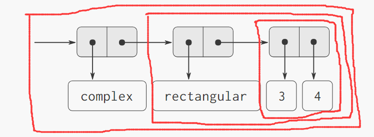
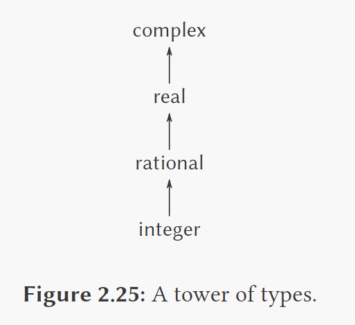
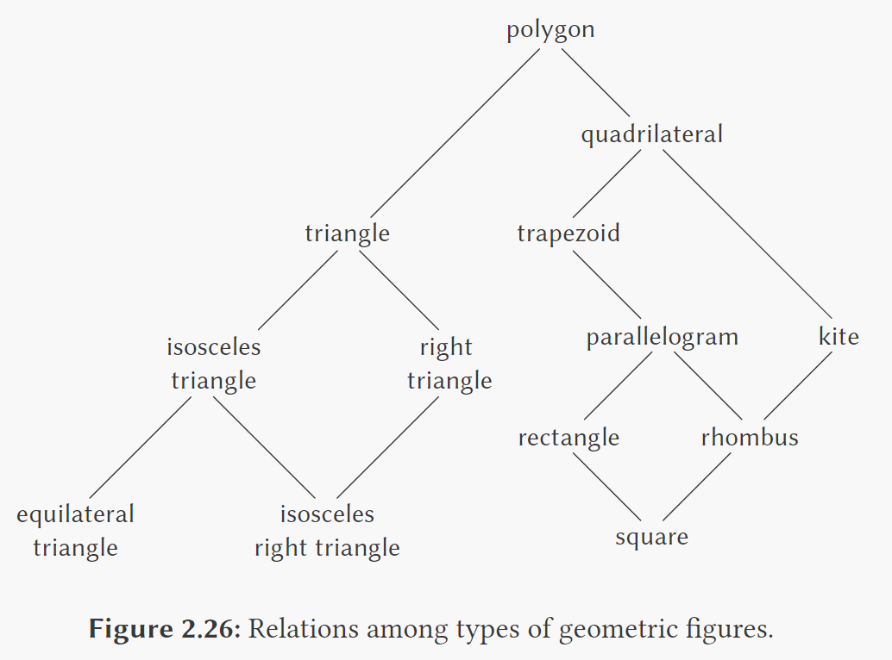
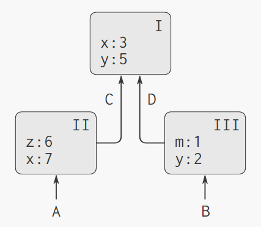
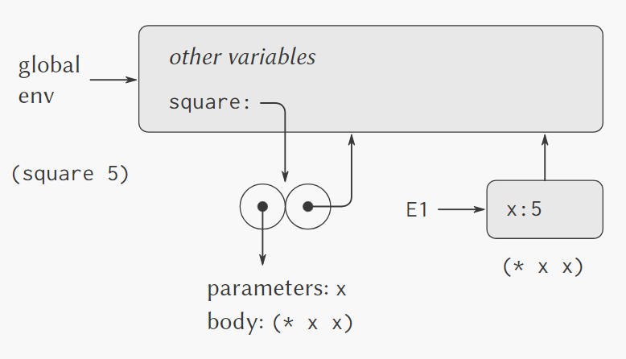
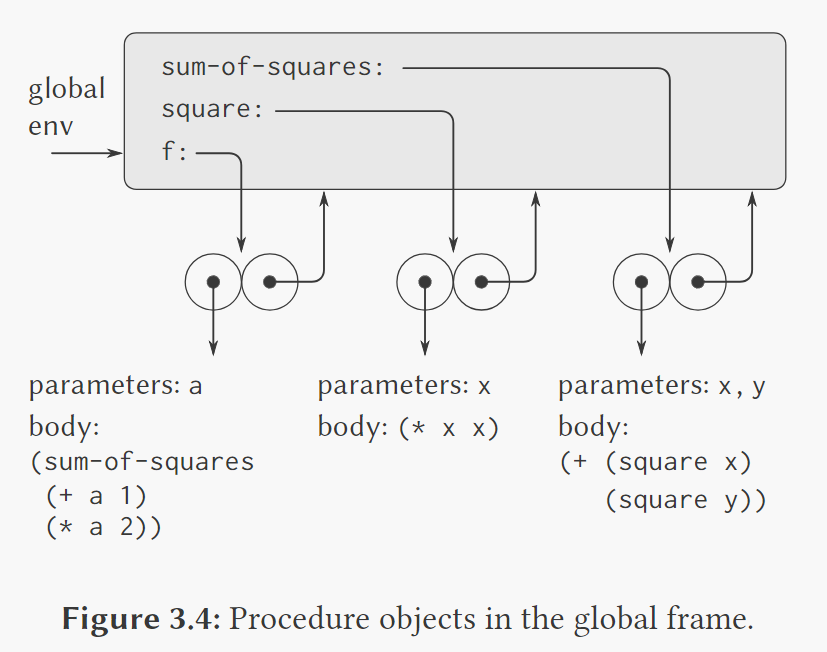
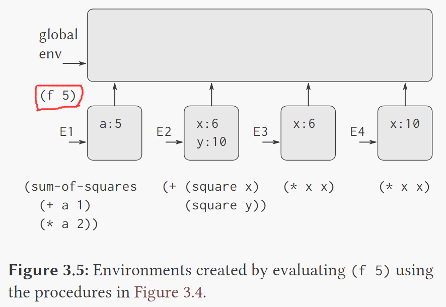
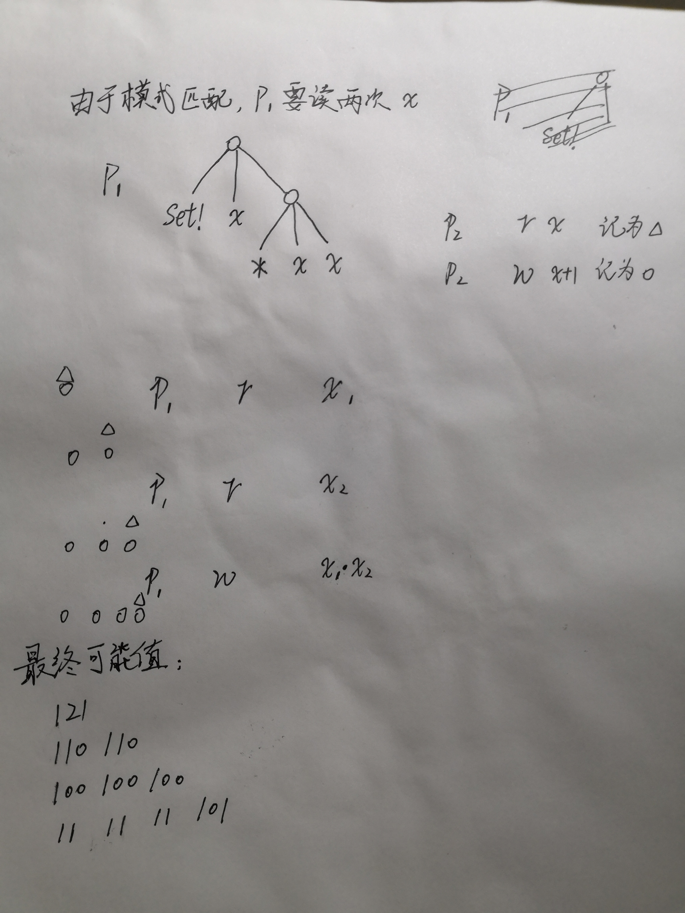
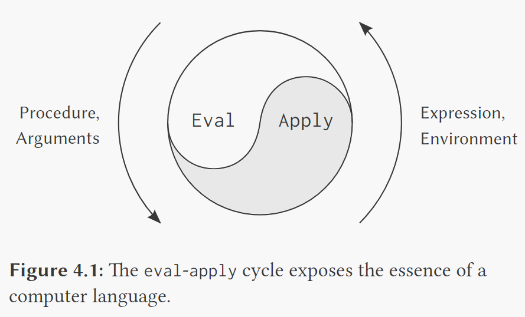

# SICP note

[视频教程](https://github.com/DeathKing/Learning-SICP)   
[SICP book online](https://sarabander.github.io/sicp/html/index.xhtml)   

其他笔记：

- [Keep Writing Codes - Lisp 追随者，SICP 受益者，持续分享编程心得](https://liujiacai.net/tags/sicp/)
- [鉴心 - blog](http://coderyang.com/tags/sicp/)

其他题解：

- [Articles in tag "SICP"](https://eli.thegreenplace.net/tag/sicp)
- [SICP 解题集](https://sicp.readthedocs.io/en/latest/)

&nbsp;   

-----

- [第一章 构造抽象过程](#1)
  - [程序设计的基本元素](#1.1)
  - [过程与它们所产生的计算](#1.2)
  - [用高阶函数做抽象](#1.3)
- [第二章 构造数据抽象](#2)
  - [数据抽象导引](#2.1)
  - [层次性数据和闭包性质](#2.2)
  - [符号数据](#2.3)
  - [抽象数据的多重表示](#2.4)
  - [带有通用型操作的系统](#2.5)
- [第三章 模块化、对象和状态](#3)
  - [赋值和局部状态](#3.1)
  - [求值的环境模型](#3.2)
  - [用变动数据做模拟](#3.3)
  - [并发：时间是一个本质问题](#3.4)
  - [流](#3.5)
- [第四章 元语言抽象](#4)
  - [元循环求值器](#4.1)
  - [Scheme的变形——惰性求值](#4.2)
  - [Scheme的变形——非确定性计算](#4.3)
  - [逻辑程序设计](#4.4)
- [第五章 寄存器机器里的计算](#5)
  - [寄存器机器的设计](#5.1)
  - [一个寄存器机器模拟器](#5.2)
  - [存储分配和废料收集](#5.3)
  - [显式控制的求值器](#5.4)
  - [编译](#5.5)

TODO:

- [Church 计数 - ex 2.6](#church)

&nbsp;   
&nbsp;   

# 第一章 构造抽象过程

&nbsp;   

## 1.1 程序设计的基本元素

- **表达式**：前缀形式
- **组合**：
- **抽象**：命名，使用名称去引用一个运算结果。（这意味着 interpreter 必须维护某种存储能力，被称为 **环境**）

过程定义：  
`(define (<name> <formal parameters>) <body>)`  

代换模型：将过程调用替换为函数体。   

**应用序** 和 **正则序**：

- 应用序：先求值参数而后应用。
- 正则序：完全展开之后规约。

>Lisp 采用应用序求值，部分原因在于这样做能避免对于表达式的重复求值，从而可以提高一些效率。更重要的是，在超出了可以采用代换方式模拟的过程范围后，正则序的处理将变得复杂得多。

&nbsp;   

**条件表达式** 和 **谓词**：

    (cond (<p1> <e1>)
          (<p2> <e2>)
          ..
          (<pn> <en>))
**条件表达式的求值方式**如下：   
首先求值谓词`<p1>`，如果它的值是`false`，那么继续向下求值，知道发现了某个谓词的值为`true`，返回相应的序列表达式`<e>`的值，以这个值作为条件表达式的值。如果没有，则没有定义。最后可以出现 `else` ，行为如同 default.  

>注：`<e>`可以是一个表达式的序列，如果对应的`
`为真，那么`<e>`会被顺序求值，并将最后一个表达式的值作为返回值。

&nbsp;   

特殊形式：`if`   
`if <predicate> <consequent> <alternative>`   
**在求值一个`if`表达式时**，解释器从求值其`<predicate>`部分开始，如果`<predicate>`得到真值，解释器就去求值`<consequent>`并返回其值，否则就去求值`<alternative>`并返回其值。
   

>注：`if` 是一种特殊的形式，`<consequent>`和`<alternative>`只有一个被求值。   
>而在练习1.6提出的问题中，`new-if`被定义如下：   
>(define (new-if predicate then-clause else-clause)  
&emsp;&emsp;(cond (predicate then-clause)  
&emsp;&emsp;&emsp;&emsp;&emsp;(else else-clause)))   
>`new-if`会对两个子表达式都进行求值。

&nbsp;   

其他复合运算：   
`(and <e1> ... <en>)`   
`(or <e1> ... <en>)`   
`(not <e>)`

注意`and`和`or`都是特殊形式而不是普通的过程，因为它们的子表达式不一定都求值。而`not`则是一个普通的过程。

&nbsp;   

**黑箱抽象**：

- **过程抽象**：只关心功能与接口格式。分解中的每一个过程完成了一件可以清楚标明的工作，这使它们可以用作定义其他过程的模块。
- **形参局部名**：过程的形式参数应该是相应过程体里的局部名字。
- **内部定义** 和 **块结构**：核心过程中依赖的其他过程应该被内部化，否则会污染其他库实现。（即这些辅助函数不够全局）

如果在一个完整的过程里面**约束变量**全部换名，那么过程的意义将没有任何改变。   
如果一个变量是不被约束的，我们称它为**自由**的。  
**作用域**：被声明为过程的形参的约束变量，就以这个过程的体(`body`)作为它们的作用域。

内部定义与块结构：  

    #lang sicp
    (define (square x) (* x x) )
    (define (average x y) (/ (+ x y) 2))
    
    (define  (sqrt x)
      (define (good-enough? guess x)
          (< (abs (- (square guess) x)) 0.001)
      )
      (define (improve guess x)
          (average guess (/ x guess))
      )
      (define (sqrt-iter guess x)
          (if (good-enough? guess x)
          guess
          (sqrt-iter (improve guess x) x))
      )
     (sqrt-iter 1.0 x)
    )

使用块结构的好处：

- 将辅助过程定义到内部
- 不用显式的传递某些参数，可以让这些参数作为内部定义中的自由变量（词法作用域）

&nbsp;   

## 1.2 过程与它们所产生的计算

- 递归计算过程：计算过程构造一个 **推迟进行的操作** 所形成的链条，收缩阶段表现为这些运算的实际执行。（解释器需要维护好那些以后将要执行的操作的轨迹）
- 迭代计算过程：那种其状态可以用固定数目的状态变量描述的计算过程；而与此同时，又存在着一套固定的规则，描述了计算过程在从一个状态到达下一个状态转换时，这些变量的更新方式；还有一个（可能有的）结束检测，它描述这一计算过程应该终止的条件。

对于**树形递归**，计算中的每一点，我们都只需保存树中在此之上的结点的轨迹。一般来说，树形递归的计算过程所需的步骤将正比于树中的结点树，其空间需求正比于树的最大深度。

&nbsp;   

## 1.3 用高阶函数做抽象

强大语言的需求：为公共的模式命名，建立抽象，而后直接在抽象的层次上工作。

**高阶过程**：这样的过程，让他们以过程为参数，或者以过程为返回值。

使用 **lambda** 构造匿名过程：   
`(lambda (<formal-parameters>) <body>)`
定义过程的另一种写法：  

    (define foo
        (lambda (x) 
          return-expr))

用 **let** 创建局部变量：  

    (let ((<var1><expr1>)
          (<var2><expr2>)
          ...
          (<varn><exprn>))
     <body>)

当 let 被求值时，这里的每个名字将被关联到对应表达式的值。在将这些名字约束为局部变量的情况下求值 let 体。可以认为 let 表达式描述的变量的作用域就是该 let 的体。  

- let 使人能在尽可能接近其使用的地方建立局部变量约束。
- 变量的值是在 let 之外计算的。

**抽象**和**第一级过程**：高阶过程的重要性，就在于使我们能显式地使用程序设计语言的要素去描述这些抽象，使我们能够像操作其他计算元素一样去操作它们。   

一般而言，程序设计语言总会对计算元素的可能使用方式强加上某些限制。带有最少限制的元素被称为具有*第一级*的状态。第一级元素的某些“权利或者特权”包括：

- 可以用变量命名
- 可以提供给过程做参数
- 可以由过程作为结果返回
- 可以包含在数据结构中

Lisp 给了过程完全的第一级状态，由此获得的描述能力是及其惊人的。

>实现第一级过程的主要代价是：为使过程能够作为值返回，我们就需要为过程里的自由变量保存空间，即使这一过程并不执行。

&nbsp;   
&nbsp;   

# 第二章 构造数据抽象

将对象数据复合起来，形成*复合数据*的方式。([AOS & SOA](https://en.wikipedia.org/wiki/AOS_and_SOA))   
**数据抽象**：将 *数据对象的表示* 与 *处理数据对象的过程* 分开。

数据抽象的意义：

- 降低程序间的耦合度
- 提高设计的模块性
- 增强语言表达能力，为处理计算问题提供更多手段和方法

本章内容：

- 数据抽象
- 闭包
- 符号表达式
- 通用型操作符
- 数据导向的程序设计

&nbsp;   

## 2.1 数据抽象导引

数据抽象的基本思想：

- 就是设法构造出一些使用复合数据对象的程序，使它们就像是在“抽象数据”上操作一样，它们不对所用数据做任何多余的假设。
- 为每一类数据对象标识出一组操作，使得对这类数据对象的所有操作都可以基于它们表述。

**序对**：

    (car (cons a b)) -> a
    (cdr (cons a b)) -> b

可能的实现：（由 `cons` 返回的值是一个过程）

    (define (cons a b)
        (lambda (pick)
             (cond ((= pick 1) a)
                   ((= pick 2) b))))
                   
    (define (car x) (x 1))
    (define (cdr x) (x 2))

因此，序对的这一过程实现确实是一个合法的实现，如果只通过 `cons`、 `car` 和 `cdr` 访问序对，我们将无法把这一实现与“真正的”数据结构分开。   
上面展示了序对的一种过程性表示，这并不意味着我们所用的语言就是这样做的（Scheme 和一般的 Lisp 系统都直接实现序对，主要是为了效率），而是说它确实可以这样做。   
**数据的过程性表示将在我们的程序设计宝库里扮演一种核心角色。有关的程序设计风格通常被称为消息传递。**

练习 2.4 另一种序对的实现：

    (define (cons x y)
      (lambda (m) (m x y)))
    
    (define (car c)
      (c (lambda (p q) p)))
      
    (define (cdr c)
      (c (lambda (p q) q)))

练习 2.6 Church计数：

&nbsp;   

## 2.2 层次性数据和闭包性质

一般说，某种组合数据对象的操作满足**闭包性质**，那就是说，通过它组合起数据对象得到的结果本身还可以通过同样的操作再进行组合。   
所有程序都依赖于一个事实：组合式的成员本身还可以是组合式。    

强健设计的语言层次：

- 分层设计：构造各个层次的方式，就是设法组合起作为这一层次中部件的各种基本元素，这样构造出的部件又可以作为另一个层次里的基本元素。
- 每个层次都提供了一些**基本元素**、**组合手段**和**对该层次中的适当细节做抽象的手段**。
- 分层设计有助于使程序更加健壮，使我们更有可能在给定规范发生一些小改变时，只需对程序做少量的修改。

&nbsp;   

## 2.3 符号数据

为了扩充语言的表述能力，引进任意符号作为数据的功能。需要有一种新元素：为数据对象加**引号**的能力。

&nbsp;   

## 2.4 抽象数据的多重表示

**数据抽象屏障**是控制复杂性的强有力工具。通过对数据对象基础表示的屏蔽，我们就可以将设计一个大程序的任务，分割为一组可以分别处理的较小任务。   
对于一个数据对象也可能存在*多种有用的表示方式*，而且我们也可能希望所设计的系统能够处理*多种表示方式*。因此需要抽象屏障去隔离互不相同的设计选择，以便允许不同的设计选择在同一个程序里共存。   

- **通用型过程**：在不止一种数据表示上操作的过程。（这里的主要技术是：在带有 **类型标志** 的数据对象上工作）
- **类型标志**：数据对象包含着它们应该如何处理的明确信息。([Ad-hoc overloading Polymorphism](https://en.wikipedia.org/wiki/Ad_hoc_polymorphism) & [Parametric Polymorphism](https://en.wikipedia.org/wiki/Parametric_polymorphism))
- **数据导向的程序设计**：

&nbsp;   
### 带标志数据：   
认识数据抽象的一种方式是将其看作 “最小允诺原则” 的一个应用。   
抽象屏障使我们可以把为自己所用数据对象选择具体表示形式的事情尽量向后推，而且还能保持系统设计的最大灵活性。   
*那么就需要有一种方式，将不同的数据表示分开。*   
完成这种区分的一种方式， 就是在数据对象里包含一个 **类型标志** 部分。   

每个通用选择过程都需要实现为这样的过程，它首先检查参数的标志，而后去调用处理该类数据的适当过程。   
因为每个数据对象都以其类型作为标志，选择函数就能够在不同的数据上以一种通用的方式操作。也就是说，每个选择函数的定义行为依赖于它操作其上的特定的数据类型。   
在将数据对象从一个层次传到另一个层次的过程中，这种剥去和加上标签的规范方式成为一种重要的组织策略。（[Type erasure](https://en.wikipedia.org/wiki/Type_erasure)）

&nbsp;   
### 数据导向的程序设计和可加性：   
检查一个数据项的类型，并据此去调用某个适当过程称为 **基于类型的分派**。在系统设计中，这是一种强有力的策略。   
而另一方面，通过 `if-else` 来判断类型并派发过程有另个显著地弱点：

- 其中的这些通用型界面过程必须知道所有的不同表示。
- 即使这些独立的表示形式可以分别设计，我们也必须保证在整个系统里不存在两个名字相同的过程。

这两个弱点带来的问题是：   
上面这种实现通用型界面的技术不具有 **可加性**。   
在每次增加一种新表示形式时，实现通用选择函数的人都必须修改他们的过程，而那些做独立表示的界面的人也必须修改其代码，以避免名字冲突问题。在做这些事情时，所有修改都必须直接对代码去做，而且必须准确无误。这当然会带来极大的不便，而且还很容易引进错误。   

**数据导向的程序设计**：能够将系统设计进一步模块化的方法。   
在需要处理的是针对不同类型的一集公共通用型操作时，事实上，我们正在处理一个二维表格，其中的一维上包含着所有的可能操作，另一个维上就是所有的可能类型。   
数据导向的程序设计就是一种使程序能直接利用这种表格工作的程序设计技术。   
实现这样一个过程，去做基于类型的显示分派：用操作名和参数类型的组合到表格中查找，以便找出应该调用的适当过程。   

&nbsp;   
### 消息传递：   
在数据导向的程序设计里，最关键的想法就是通过显式处理操作—类型表格的方式，管理程序中的各种通用操作。   
两种实现策略：

- 基于类型的分派，其中让每个操作管理自己的分派。
- 将表格按列进行分解，采用 “智能数据对象”，让它们**基于操作名完成所需的分派工作**。（做法：将每一个数据对象表示为一个过程。它以操作的名字作为输入，能够去执行指定的操作。）

采用“智能数据对象”的程序设计风格称为：**消息传递**。   
这一名字源自将数据对象设想为一个实体，它以 “消息” 的方式接收到所需操作的名字。

&nbsp;   

## 2.5 带有通用型操作的系统

在一个大型的复杂系统里可能有许多层次，每层与下一层次之间的连接都借助于一些通用型操作。当一个数据对象被“向下”传输时，用于引导它进入适当程序模块的最外层标志被剥除，下一层的标志变为可见的，并将用于下一次分派。

### 不同类型数据的组合：   
这牵扯到一个问题：由谁来负责这些过程。在设计包含许多程序模块和许多跨类型操作的系统时，要想规划好一套统一的策略，分清各种模块之间的责任，很容易变成一个非常复杂的任务。   

**强制**（**coercion**）：（可以利用潜藏在类型系统之中的一些额外结构）   
不同的数据类型通常都不是完全相互无关的，常常存在一些方式，使我们可以把一种类型的对象看作另一种类型的对象。   
实现手段：   
1. 设计出一些强制过程，它们能把一个类型的对象转换到另一类型的等价对象。   
2. 将这些强制过程安装到一个特殊的强制表格中，用两个类型的名字作为索引。   
3. 应用一个操作时，首先检查是否存在针对实际参数类型的操作定义，就像前面一样。如果存在，那么就将任务分派到由 “操作—类型” 表格中找出相应的过程，否则就去做强制。   

与显式定义的跨类型操作相比，这种强制模式有许多优越性：虽然仍要写出与类型有关的强制过程，但是只需要为每一对类型写一个过程，而不是为每对类型和每个通用型操作写一个过程。能够这样做的基础就是：类型之间的适当转换至依赖于类型本身，而不依赖于所实际应用的操作。

### 类型的层次结构

在实际中，还存在着不同类型相互关系更全局性的结构。   
   
称为：塔结构   
此后，当系统遇到需要对两个不同类型的运算时，它就可以逐步提升较低的类型，直至所有对象都达到了塔的同一个层次。   
于是很自然地引入一个概念：**继承**

### 层次结构的不足
如果在一个系统里，有关的数据类型可以被自然地安排为一个塔型，那么处理不同类型上通用型操作的问题将能得到极大的简化。遗憾的是，事情通常不是这样。   
一个类型有可能有东哥子类型，也有可能有多个超类型，这就意味着：   
**并不存在一种唯一的方式在层次结构中去 “提升” 一个类型。**   
   
当需要将一个操作应用于一个对象时，为此找出“正确”超类型的工作可能涉及到对整个类型网络的大范围搜索。   
**在设计大型系统时，处理好一大批有关的类型而同时又能保持模块性，这是一个非常困难的问题。**   
>注：今天已经有了一批各式各样的并不合适的本体理论，它们已经被嵌入到数量过多而又先天不足的各种程序设计语言里。**面向对象语言的核心是对类型之间通用型操作的处理**。但“类”与“继承”并非最佳实践。事实上，目前的猜想是：如果没有知识表述和自动推理工作的帮助，这些问题是无法仅仅通过计算机语言设计的方式合理处理的。

一种类型的对象事实上可以是一个复杂的对象，又以许多不同类型的对象作为其组成部分。这种情况并不会给通用型操作增加任何实际困难。需要做的就是针对这种复合对象的各个部分的操作，并安装好适当的通用型过程。

在设计大型系统时，大部分复杂性都牵扯到多个类型之间的关系。确实，人们到现在都还没有完全理解强制。事实上，人们还没有完全理解类型的概念。但无论如何，已知的东西已经为我们提供了支持大型系统设计的强有力的结构化和模块化原理。

&nbsp;   
&nbsp;   

# 第三章 模块化、对象和状态

一种强有力的设计策略，特别适合用于构造那类模拟真实物理系统的程序：**基于被模拟系统的结构去设计程序的结构**

- 对于有关的物理系统里的每个对象，我们构造一个与之对应的计算对象
- 对该系统里的每种活动，我们在自己的计算系统里定义一种符号操作

两种策略：

- **对象**：将一个系统看成一大批对象，它们的行为可能随着时间的进展而不断变化。
- **信息流**

在处理对象、变化和标识时，各种困难的基本根源在于我们需要在这一计算模型中与时间搏斗。如果允许程序**并发**执行的可能性，事情就会变得困难的许多。**流方式** 特别能够用于松解在我们的模型中对时间的模拟与计算机求值过程中的各种事件发生的顺序。这种技术称为 “**延时求值**”。

&nbsp;   

## 3.1 赋值和局部状态

每个对象都有自己的随时间变化的状态。   
**状态变量**：用来刻画一个对象的状态，在它们之中维持着对象的充分信息。   
每个对象都可能通过交互作用，影响其他对象的状态。   

模块化 →    
分解为一批计算对象，用来模拟 →    
对象有局部状态变量，用于描述对象的状态 →    
由于被模拟系统里的对象的状态是随时间变化的，与它们相对应的计算对象的状态也必须变化 →    
如果要通过计算机中的时间流逝去模拟实际的时间流逝，那么计算对象的行为必须是可以随着程序运行而改变的 →    
如果希望用程序设计语言中的符号名字去模拟状态变量 →    
语言必须提供一个赋值运算符

`(SET! <var> <value>)`

一旦在语言里引进了赋值，代换就不再适合作为过程应用的模型了

### 引进赋值带来的利益

将系统看作是一集带有局部状态的对象，也是维护模块化设计的强有力技术。

从一个复杂计算过程中一部分的观点看，其他部分都像是在随着时间不断变化，它们隐藏起自己的随时间变化的内部状态。   
假设我们希望写出一个计算机程序，反应这种系统分解，那么就需要让计算对象的行为随着时间变化，用局部状态变量去模拟系统的状态，用对这些变量的赋值去模拟状态的变化。

与所有状态都必须显式地操作和传递额外参数的方式相比，通过引入赋值和将状态隐藏在局部变量中的技术，我们能以一种更模块化的方式构造系统。（可惜的是事情并不是这么简单，我们很快会看到这一点）

### 引进赋值的代价

引入赋值操作后，程序语言不能再用过程应用的**代换模型**解释了。

不用任何赋值的程序设计称为 *函数式程序设计*。

从本质上说，代换的最终基础就是，这一语言里的符号不过是作为值得名字。而一旦引入了赋值操作，一个变量就不再是一个简单的名字了。现在的一个变量索引着一个可以保存值的位置，而存储在那里的值也是可以改变的。

#### 同一和变化

从这里暴露出的问题，远远不是打破了一个简单的计算模型，其意义要深远得多。一旦将变化引入了我们的计算模型，许多以前非常简单明了的概念现在都变得有问题了。   
首先考虑两个物体实际上“同一”的概念。如果一个语言在表达式里支持“同一的东西可以相互替换”的概念，这样替换不会改变表达式的值，这个语言就称为是具有 *引用透明性*。   
在我们的计算机语言包含了赋值操作之后，也就打破了引用透明性，就使确定能否通过等价的表达式代换去简化表达式变成了一个异常错综复杂的问题了。

#### 命令式程序设计的缺陷

广泛采用赋值的程序设计被称为 *命令式程序设计*。

一般而言，带有赋值操作的程序强迫人们去考虑赋值的**相对顺序**，以保证每个语句所用的是被修改变量的正确版本。在函数式程序设计中，这类问题根本就不会出现。

&nbsp;   

## 3.2 求值的环境模型

由于赋值操作的存在，此时的变量必须以某种方式指定了一个“位置”，相应的值可以存储在那里。在我们的新求值模型里，这种位置将维持在称为 **环境** 的结构中。   
一个环境就是框架的一个序列，每个框架是包含着一些 **约束** 的表格，这些约束将一些变量名字关联于对应的值（在一个框架里，任何变量至多只能有一个约束）。每个框架还包含着一个**指针**，指向这一框架的*外围环境*。   
一个*变量*相对于某个特定环境的*值*，也就是在这一环境中，包含着该变量的第一个框架里这个变量的约束值，如果在这个序列中并不存在这一变量的约束，那么我们就说这个变量在该特定环境中是无约束的。

环境对于求值过程是至关重要的，因为它确定了表达式求值的上下文。

### 求值规则

>如果要对一个组合表达式求值：   
>1. 求值这一组合式里的各个子表达式。   
>2. 将运算符子表达式的值应用于运算对象子表达式的值。   
>
>现在我们要用求值的环境模型代替求值的代换模型。

**在求值的环境模型里，一个过程总是一个对偶，由 一些代码 和 一个指向环境的指针 组成。**

过程只能通过一种方式创建，那就是通过求值一个 lambda表达式。这样产生出的过程的代码来自这一 lambda表达式 的正文，其环境就是求值这个 lambda表达式，产生出这个过程时的那个环境。

**过程的应用**：   
环境模型说明：在将一个过程应用于一组实际参数时，将会建立起一个新环境，其中包含了将所有形式参数的约束于对应的实际参数的框架，该框架的外围环境就是所用的那个过程的环境。随后就在这个新环境之下求值过程的体。

>过程的应用：创建一个新的框架，并将形式参数约束到实际参数，外围环境指针指向过程的环境。

**过程应用的环境模型**：

- 将一个过程对象应用于一集实际参数，将构造出一个新框架，其中将过程的形式参数约束到调用时的实际参数，而后在构造起的这一新环境的上下文中求值过程体。这个新框架的外围环境就是作为被应用的那个过程对象的一部分的环境。
- 相对于一个给定环境求值一个 lambda表达式，将会创建起一个过程对象，这个过程对象是一个序对，由该 lambda表达式 的正文和一个指向环境的指针组成，这一指针指向的就是创建这个过程对象时的环境。

赋值操作的行为方式：   
在某个环境里求值 *赋值表达式* 时，要求我们首先在环境中确定有关变量的约束位置，而后再修改这个约束，使之表示这个新值。   
这也就是说，首先需要找到包含这个变量的约束的第一个框架，而后修改这一框架。如果该变量在环境中没有约束，将报告一个错误。

### 例子：简单过程的应用

   
    
求值 `(f 5)`：   
1. 创建一个新环境 `E1`，参数 `a` 被约束到 5。在 `E1` 中求值 `(sum-of-square (+ a 1) (* a2))`  
2. 求值组合式，首先求值子表达式。第一个子表达式 `sum-of-square` 以一个过程对象为值。（在 `E1` 的框架中未寻找到约束，而后进入有关的外围环境，并找到约束）
3. 创建环境 `E2`，现在需要把过程对象 `sum-of-square` 应用于实参 6 和 10。

这里就是通过不同的框架，去维持所有局部变量互不相同。

### 将框架看作局部状态的展台

### 内部定义

**环境模型**已经解释清楚了以局部过程定义作为**程序模块化**的有用技术中的两个关键性质：

- 局部过程的名字不会与包容它们的过程之外的名字互相干扰，这是因为这些局部过程名都是在该过程运行时创建的框架里面约束的，而不是在全局环境里约束的。
- 局部过程只需将包含着它们的过程的形参作为自由变量，就可以访问该过程的实际参数。这是因为对于局部过程体的求值所在的环境是外围过程求值所在的环境的下属。

&nbsp;   

## 3.3 用变动数据做模拟

这节是例子。

&nbsp;   

## 3.4 并发：时间是一个本质问题

代价：丢掉了引用透明性，还必须抛弃求值的代换模型，转而采用更复杂也难把握的环境模型。   
引入赋值之后，就必须承认时间在所用的计算模型的位置。   

将计算模型划分为一些能各自独立地并发演化的部分，常常也是很合适的。   
在出现了并发的情况下，由赋值引入的复杂性问题将变得更加严重了。并发执行的出现会在我们对时间的理解中加入进一步的复杂性。

### 并发系统中时间的性质

表面上看，时间是强加在各种事件上的一个顺序。   
事件顺序的非确定性，可能对并发系统的设计提出了严重的问题。   

复杂的原因：多个进程有可能同时试图去操作共享的状态。

>在本节，我们将 “计算过程” 翻译为 “进程”

### 并发程序的正确行为

- 对并发地一种可能限制方式是：规定能修改共享状态变量的两个操作都不允许同时发生。（**低效**）
- 另一种不严厉的方式是：保证并发系统产生的结果与各个进程按照某种方式顺序运行产生出的结果完全一样。
  - 它并没有要求各个进程实际上顺序地运行，而只是要求它们产生的结果与 *假设* 它们顺序运行所产生的结果相同。
  - 一个并发程序完全可能产生多于一个 “正确的” 结果，因为我们只要求其结果与按照 *某种* 方式顺序化的结果相同。

### 控制并发的机制

处理并发进程的困难的根源就在于需要考虑不同进程里各个事件之间相互交错的情况。

在设计并发系统时，设法做出一些一般性的机制，使我们可能限制并行进程之间的交错情况，以保证程序具有正确的行为方式。   
人们已经为此目的而开发了许多不同的机制，我们讨论其中的一种：**串行化组**（serializer）

### 对共享变量的串行访问

**串行化**：使进程可以并发地执行，但是其中也有一些过程不能并发地执行。

**串行化就是创建一些不同的过程集合，并且保证在每个时刻，在任何一个串行化集合里至多只有一个过程的一个执行。**

举例：如果我们基于某个共享变量已有的值去更新它，那么就应该将 *访问这一变量的现有值* 和 *给这一变量赋新值* 的操作都放入同一个过程里。而后设法保证，任何能给这个变量赋值的过程都不会与这个过程并发运行，方法是将所有这样的过程都放在同一个串行化集合里。这就保证了在访问一个变量和它赋值之间，这一变量的值不会改变。

例子：   
   

使用 *串行化组* 限制后，最终只有两种可能值：121 和 101.

### 使用多重共享资源的复杂性

串行化提供了一种非常强有力的抽象，能帮助我们将并发程序的复杂性孤立起来。

但是如果存在这多项共享资源，并发程序的设计就可能变得非常难以把握了。

### 串行化的实现

使用 mutex，每个串行化组关联着一个 mutex.

### 死锁

### 并发性、时间和通信

“共享状态” 究竟意味着什么？

串行化 → 屏障同步

共享变量的各方面问题也出现在大型的分布式系统里。

从本质上看，在并发控制中，任何时间概念都必然与通信有内在地密切联系。（Lamport Clock, Paxos）

&nbsp;   

## 3.5 流

我们把这些模块看成一个整体，而不是在一个特定的瞬间，互相发送状态信息的小系统。

现在我们不再认为对象之间通过 *消息传递* 来通信。

我们将基于一种 *流* 的数据结构，探索对状态进行模拟的另一条途径。

复杂性来源于：用计算机里面随着时间的变化去表示真实世界里随着时间的变化。

### 流作为延时的表

lazy evalutaion：到第一次用时才计算

### 流实现的行为方式

一般而言，可以将延时求值看作一种 “由需要驱动” 的程序设计，其中流处理的每个阶段都仅仅活动到足够满足下一阶段需要的程度。我们已经完成的工作，也就是松弛了计算中事件发生的实际顺序与过程的表面结构的关系。这样写出的过程就像是这个流已经“不折不扣地完全”放在那里，而实际上，这一计算的执行是逐步执行的，就像传统程序设计一样。

为了避免重复求值，在构造延时对象时，使它们在第一次被迫求值之后可以保存起求出的值，而不必重复进行计算。称作 **记忆化**。

### 流计算模式的使用

流方法极富有启发性，因为借助于它去构造系统时，所用的模块划分方式可以与采用赋值、围绕着状态变量组织系统的方式不同。因为我们将实际执行时间与计算机程序的时间**解耦**。

我们可以将整个的时间序列作为关注的目标，而不是去关注有关状态变量在各个时刻的值。这将使我们能更方便地组合与比较来自不同时刻的状态成分。

#### 系统地将迭代操作方式表示为流过程

状态可以表示为值的 “没有时间的” 流。

>欧拉 - 交错级数 - 加速器

#### 序对的无穷流

由 delay 和 promise 的出现，我们就可以定义 **递归的数据**。

    (define ones 
        (cons-stream 1 (delay ones)))
    ;这样就得到了无穷个1的流

    (define fibs
        (cons-stream 0
            (cons-stream 1
                add-streams fibs (tail fibs))))
    ;仔细观察这个 fib 的实现，其中 add-streams 是将两个流对应项相加，生成一个新的流。

#### 将流作为信号

用流去模拟包含反馈循环的信号处理系统

#### 流和延时求值

定义反馈循环的能力依赖于 delay。

在利用流去模拟包含循环的信号处理系统时，delay是至关重要的。如果没有 delay，我们的模拟就不得不这样描述，其中要求对每个信号处理部件的输入都能在产生输出之前完成求值。这也就完全把循环排除在外了。

有时，还需要显式的使用 delay。

#### 规范序求值

我们可以采用一种求值模型，其中所有过程参数都自动延时，只有在实际需要它们的时候才强迫参数求值。即 **规范序求值**。

不幸的是，把延时包含到过程调用中，将会对我们设计依赖于事件顺序的程序能力造成极大损害。

### 函数式程序的模块化和对象的模块化

- 引进赋值的主要收益就是使我们可以增强系统的模块化，把一个大型系统的状态中的某些部分封装。
- 流模型可以提供等价的模块化，同时又不必使用赋值。

#### 时间的函数式程序设计观点

- 引进赋值和变动对象，就是为了提供一种机制，以便能够模块化的构造出程序，去模拟具有状态的系统。我们构造了包含内部状态变量的计算对象，用赋值去修改这些变量。我们利用对应计算对象的时序行为去模拟现实世界中的各种对象的时序行为。
- 用流去模拟一个变化的量，例如某个对象的内部状态，用流表示其顺序状态的时间史。从本质上说，这里的流将时间显式地表示了出来，因此就解耦了被模拟的世界里的时间与求值过程中事件发生顺序之间的紧密联系。确实，由于 delay 的出现，在模型中被模拟的时间与求值中事件发生的顺序之间已经没有什么联系了。

>这体现出 “芝诺悖论”：状态本身是不改变的，只是由无穷的流式的信息组成。

消除这一悖论的一种方式是认识到：**正是由于用户方的时态的存在，为这个系统赋予了状态特性。**（如果用户从自己的交互问题上后退一步，以余额流的方式思考问题，而不是去看个别的交易，这个系统看上去就是无状态的了）

不过现在有个麻烦事：在设计交互式系统时，如果需要去模拟一些独立对象之间的交互，就会有 **归并（fair merge）** 的问题。

**无论归并如何实现，它都必须在某种由交互对象可以看到的 “真实时间” 的约束之下归并流。这也就是说，存在一个时间点(sequence point)，认为某些交易在这之前已经完成，其他交易将在这之后完成。**

**目标**：构造出一些计算模型，使其结构能够符合我们对于试图去模拟的真实世界的看法。

- 将这一世界模拟为一集相互分离的、受时间约束的、具有状态的相互交流的对象
- 将其模拟为单一的、无时间也无状态的统一体

&nbsp;   
&nbsp;   

# 第四章 元语言抽象

如之前几章所看到的，**设计复杂系统的通用技术**：将基本元素组合起来，形成复合元素，从复合元素出发通过抽象形成更高一层的构件，并通过采取某种适当的关于系统结构的大尺度观点，保持系统的模块性。

>于是我们必须经常转向新的语言，来更有效地表述自己的想法，以便提升处理复杂问题的能力。

**元语言抽象**就是建立新的语言。我们不仅可以设计新的语言，还可以通过构造求值器的方式实现这些语言。对于某个程序设计语言的求值器（解释器）也是一个过程，在应用于这个语言的一个表达式时，它能够执行求值这个表达式所要求的动作。

#### 求值器决定了一个程序设计语言中各种表达式的意义，而它本身也不过就是另一个程序。

&nbsp;   

## 4.1 元循环求值器

求值的环境模型包括两部分：

- 在求值一个组合式（非特殊形式的复合表达式）时，首先求值其中的子表达式，而后将 **运算符子表达式的值** *作用于* **运算对象子表达式的值**。
- 在将一个复合过程应用于一集实际参数时，我们在一个新的环境里求值这个过程的体。构造这一环境的方式就是**用一个框架扩充该过程对象的环境部分**，框架中包含的是这个过程的各个**形式参数**与这一过程应用的各个**实际参数**的*约束*。

这两条规则描述了求值过程的核心部分，也就是它的基本循环。在这一循环中，表达式在环境中的求值被规约到过程对实际参数的应用，而这种应用又被规约到新的表达式在新的环境中的求值，直到我们下降到符号或者基本过程。

这一求值循环实际体现为求值器里的两个关键过程 `eval` 和 `apply` 的相互作用。

### 求值器的内核

求值过程可以描述为两个过程 `eval` 和 `apply` 之间的相互作用。

#### eval

`eval` 的两个参数是 一个**表达式** 和 一个**环境**。`eval` 对表达式进行分类，依次引导自己的求值工作。

`eval` 的构造就像是一个针对被求值表达式的语法类型的分情况分析。针对每类表达式有一个谓词完成相应的检测，有一套抽象的方法去选择表达式里的各个部分。

- 基本表达式：
  - 自求值表达式，各种常数，`eval` 直接返回这个表达式本身。
  - `eval` 在环境中查找变量，找出它们的值。
- 特殊形式：
  - 对于加引号的表达式，`eval` 返回被引的表达式。
  - 对于变量的赋值（或者定义），就需要递归地调用 `eval` 去计算出需要关联这个变量的新值。而后需要修改环境，以改变（或建立）相应变量的约束。
  - 一个 `if` 表达式要求对其中各部分的特殊处理方式，在谓词为真时求值其推论部分，否则就求值其替代部分。
  - 一个 `lambda` 必须被转换成一个可以应用的过程，方式就是将这个 `lambda` 表达式所描述的参数表和体与相应的求值环境包装起来。
  - 一个 `begin` 表达式要求求值其中的一系列表达式，按照它们出现的顺序。
  - 分情况分析（`cond`）将变换为一组嵌套的 `if` 表达式，而后求值。
- 组合式：
  - 对于一个 **过程应用**，`eval` 必须递归地求值组合式的 **运算符部分**和 **运算对象部分**。而后将这样得到的过程和参数送给 `apply`，由它去处理实际的过程应用。

#### apply

`apply` 有两个参数，一个是**过程**，一个是该过程应该去**应用的实际参数的表**。   
`apply` 将过程分为两类：

- 基本过程：直接应用
- 复合过程：顺序地求值组成该过程体的那些表达式。（在求值复合过程的体时需要建立相应的环境，这个环境的构造方式就是**扩充该过程所携带的基本环境**，并加入一个框架，其中将过程的各个形式参数**约束**于过程调用的实际参数）

### 求值器数据结构

#### 谓词检测

为了实现条件表达式，我们把除了 `false` 之外的所有东西都接受为真。

#### 对环境的操作

- 查找符号在环境中的值，若这一变量没有约束，则发出一个错误
- 创建一个新环境，这个环境中包含了一个新的框架，并指向外围环境
- 在环境中加入一个约束，若已存在这一约束，则发出一个错误
- 修改变量的约束，若变量没有这一约束，则发出一个错误

### 作为程序运行这个求值器

求值器最终把表达式规约到基本过程的应用。   
每个基本过程名必须有一个约束，以便当 `eval` 求值一个应用基本过程的运算符时，可以找到相应的对象，并将这个对象传给 `apply`。为此我们必须创建起一个初始环境，在其中建立起基本过程的名字与一个唯一对象的关联。

### 将语法分析与执行分离

重新安排求值器的工作，使有关的语法分析只进行一次。我们将以一个表达式和一个环境为参数的 `eval` 分割为两部分。过程 `analyze` 只取表达式作为参数，它执行语法分析，并返回一个新的过程，**执行过程**，其中封装起在分析表达式的过程中已经完成的工作。这个过程以一个环境作为参数，并完成实际的求值工作。

&nbsp;   

## 4.2 Scheme的变形——惰性求值

### 正则序与应用序

- 应用序：过程应用时，所有参数都需要完成求值。
- 正则序：把对过程参数的求值延后到需要这些实际参数的值的时候。将过程参数的求值拖延到最后的可能时刻，被称为**惰性求值**。

- 非严格的：如果在某个参数还没有完成求值之前就进入一个过程的体，我们就说这一过程相对于该参数是*非严格的*。
- 严格的：如果在进入过程体之前某个参数就已经完成求值，我们就说该过程相对于这个参数为*严格的*。

### 一个采用惰性求值的解释器

对于延时的参数都不进行求值，相反，将它们变换为一种称为**槽**（thunk）的对象。在槽里必须包含着为了产生这一参数的值（在需要这个值的时候）所需要的全部信息，就像它已经在应用时求出值一样。为此，槽中就必须包括参数表达式，以及这一过程应用的求值所在的那个环境。   
对槽中表达式的求值称为**强迫**（force）。可以选择采用记忆性的槽，一旦第一次被强迫，它即保存起被计算的值，随后的强迫只需要简单地返回其中保存的值，不必重复去做计算。

### 槽的表示

### 将流作为惰性的表

&nbsp;   

## 4.3 Scheme的变形——非确定性计算

为了支持一种称为**非确定性计算的程序设计范型**，我们采用的方式是将一种支持自动搜索的功能做进求值器里。

非确定性计算与流处理相似，对于 “生成和检测式” 的应用特别有价值。

非确定性程序求值器将进行有关的工作，从中选出一个可能的值，并维持有关选择的轨迹。如果随后的要求无法满足，求值器就会尝试另一种不同的选择，而且它会不断地做出新的选择，直至求值成功，或者已经用光了所有的选择。

正如惰性求值器可以使程序员摆脱有关值如何延时或者强迫的细节一样，非确定性的求值器将使程序员摆脱如何做出这些选择的细节。

将非确定性求值和流处理中引起的不同时间图景做一个比较：

- 流处理中利用了惰性求值，设法去松弛装配出可能回答的流的时间与实际的流元素产生出来的时间之间的关系。这种求值器支持这样一种错觉，好像所有可能的结果都以一种无时间顺序的方式摆在我们面前。
- 对于非确定性的求值，一个表达式表达的是对于一集可能世界的探索，其中的每一个都由一集选择所确定。某些可能世界将走入死胡同，而另一些里则保存这有用的值。非确定性程序求值器支持另一种假象：时间是有分支的，而我们的程序里保存着所有可能的不同执行历史。在遇到一个死胡同时，我们总可以回到以前的某个选择点，并沿着另一个分支继续下去。

### amb和搜索

引入一种称为 `amb` 的新特殊形式。   
表达式 `(amb <e1><e2>...<en>)` 返回 n 个表达式 `<ei>` 的值。   
`(amb)` 的求值将导致计算失败：这一计算将会流产，而且不会产生任何值。  
定义 `require`：需要某个谓词必须为真

    (define (require pred)
        (if (not pred) (amb)))

抽象地看，求值一个 `amb` 表达式将导致时间分裂为不同的分支，而计算将在每一个分支（其中取定了该表达式的一个值）里进行。我们说一个 `amb` 表示了一个**非确定性**的选择点。

- 流处理中，通过惰性求值，松解潜在的(有可能是无穷的)流和流元素的实际产生时间之间的紧密联系
  - 造成的假象是整个流似乎都存在
  - 元素的产生并没有严格的时间顺序
- 非确定性计算的表达式表示对一批“可能世界”的探索
  - 每个世界由一串选择确定
  - 求值器造成的假相：时间好像能分叉
  - 求值器保存着所有可能的执行历史
  - 计算遇到死路时退回前面选择点转到另一分支,换一个探索空间

### 执行过程和继续

继续：**continuation**

`amb` 求值器的执行过程取三个参数：环境，两个**继续过程**。

当一个表达式求值结束，就调用这两个继续过程之一：

- 如果遇到死胡同，就调用 **失败继续**。
- 如果求值得到结果，调用 **成功继续**。

- 成功继续过程：接受一个值并将计算进行下去。
- 失败继续过程：试探非确定性过程中的一个分支。

&nbsp;   

## 4.4 逻辑程序设计

- 查询
- 模式匹配
- 约束
- 规则
- 流操作
- 框架和约束

&nbsp;   
&nbsp;   

# 第五章 寄存器机器里的计算

&nbsp;   

## 5.1 寄存器机器的设计

&nbsp;   

## 5.2 一个寄存器机器模拟器

&nbsp;   

## 5.3 存储分配和废料收集

&nbsp;   

## 5.4 显式控制的求值器

&nbsp;   

## 5.5 编译

